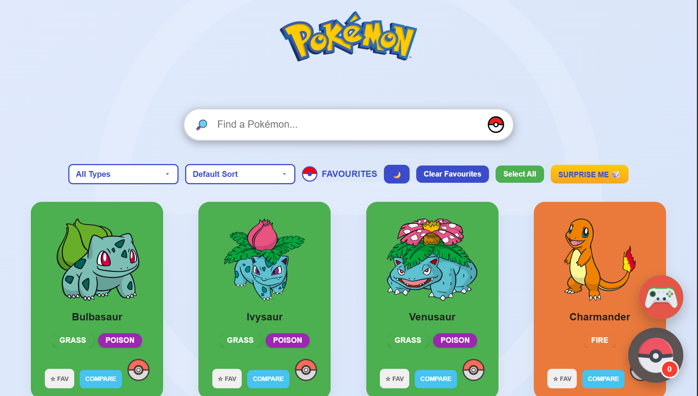
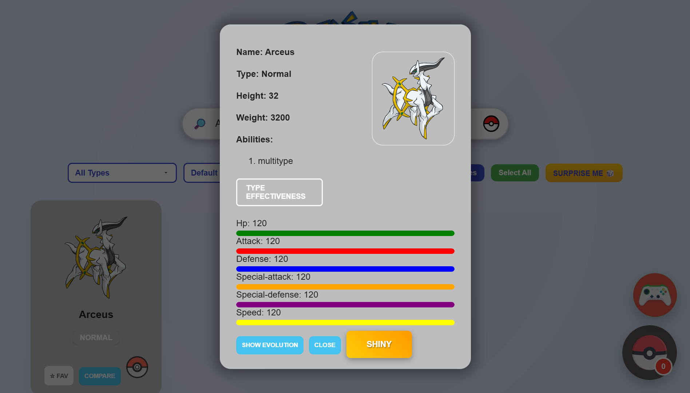
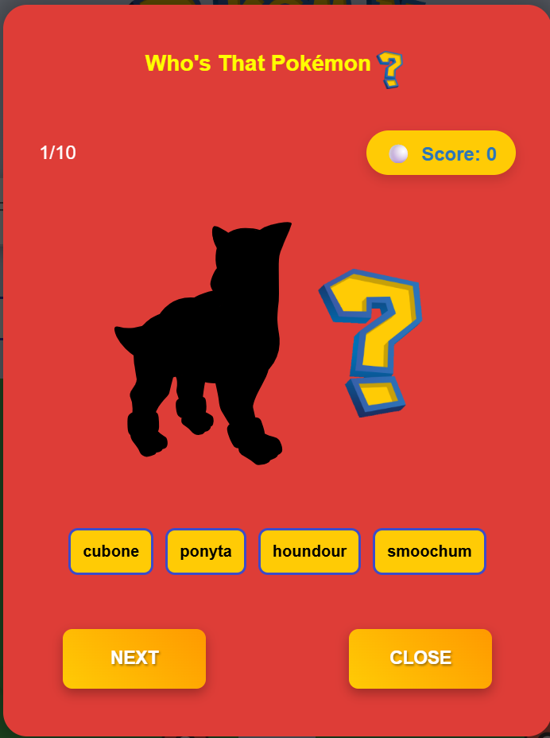
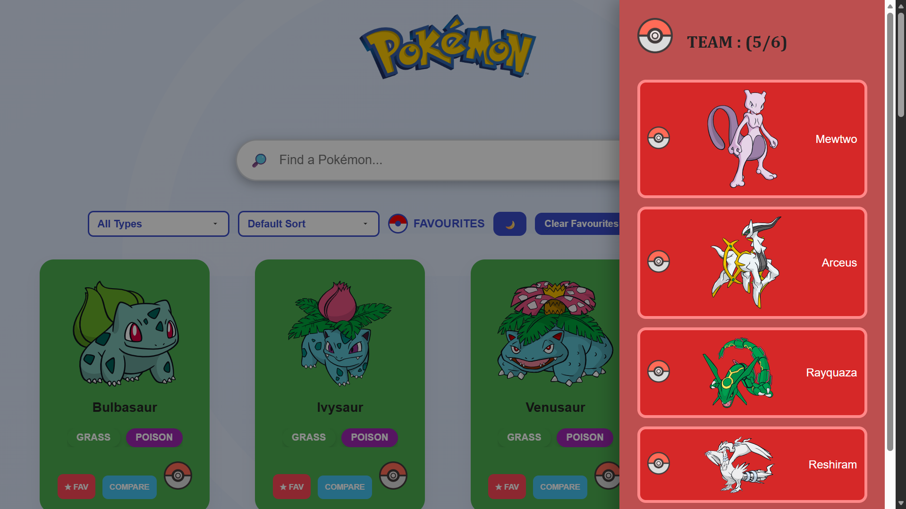
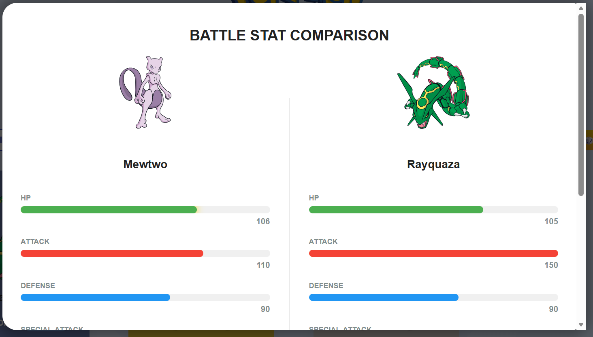
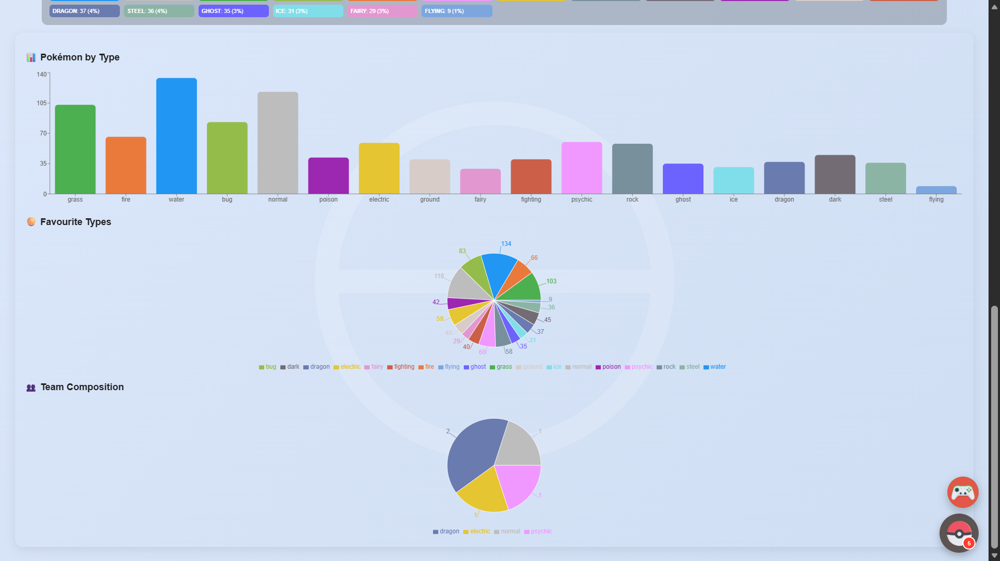

# 🚀 Pokédex Pro

An interactive and feature-rich Pokédex built with **React** and the **PokéAPI**. Search, explore, compare, build your dream Pokémon team, visualize data with charts, and even test your Pokémon knowledge through a built-in quiz.

---

## 🌐 Live Demo

🔗 **Live Website:** *pokemonapp2.vercel.app*

---

## 📸 Preview








* Home Page
* Pokémon Detail Modal
* Team Builder
* Compare Pokémon
* Dashboard & Charts
* Pokémon Quiz

---

## ✨ Features

### 🔍 Pokémon Explorer

* Search Pokémon by name
* Filter Pokémon by type
* Sort Pokémon (A–Z, Z–A, Favorites First)
* Pagination
* Random Pokémon ("🎲 Surprise Me")

### ⭐ Favorites

* Mark Pokémon as favorites
* View only favorites
* Favorite counter
* Select All Favorites
* Clear All Favorites
* Saved using LocalStorage

### 👥 Team Builder

* Add Pokémon to your team (up to 6)
* Remove Pokémon from your team
* Floating Poké Ball team button
* Team drawer sidebar
* Team count indicator

### 📊 Dashboard

* Total Pokémon
* Favorite Count
* Team Count
* Most Common Type
* Least Common Type

### 📈 Data Visualization

* Pokémon by Type (Bar Chart)
* Favorite Types (Pie Chart)
* Color-coded charts using Recharts

### ⚔️ Pokémon Comparison

* Compare two Pokémon
* Animated stat bars
* Side-by-side comparison

### 📖 Pokémon Details

* Base stats
* Height & Weight
* Abilities
* Evolution Chain
* Type Effectiveness
* Shiny Pokémon Toggle

### 🎮 Pokémon Quiz

* "Who's That Pokémon?" game
* 10-question quiz
* Randomized options
* Score tracking
* Trainer rank system
* Play Again functionality

### 🎨 UI Features

* Dark / Light Mode
* Responsive Grid Layout
* Animated Modals
* Skeleton Loading Cards
* Modern Card Design
* Type-based Color Themes

---

## 🛠️ Built With

* React
* JavaScript (ES6+)
* CSS3
* PokéAPI
* Recharts
* Vercel

---

## 📚 What I Learned

This project helped me practice and improve my understanding of:

* React Components
* Props
* useState
* useEffect
* Conditional Rendering
* Lists & Keys
* API Fetching
* Local Storage
* Component Communication
* State Management
* Recharts
* Responsive UI Design
* Project Organization
* Deploying React Apps with Vercel

---

## 🚀 Installation

Clone the repository

```bash
git clone https://github.com/Shivam2-tech/pokemonapp2
```

Navigate to the project folder

```bash
cd pokemonapp2
```

Install dependencies

```bash
npm install
```

Start the development server

```bash
npm run dev
```

---

## 🌍 API Used

**PokéAPI**

https://pokeapi.co/

---

## 📌 Future Improvements

* Pokémon abilities explorer
* Battle simulator
* Advanced team analysis
* Search by ability
* Improved mobile responsiveness
* More quiz categories

---

## 👨‍💻 Author

**Shivam Shinde**

Computer Engineering Student | Full Stack Developer

If you enjoyed this project, feel free to ⭐ the repository!
