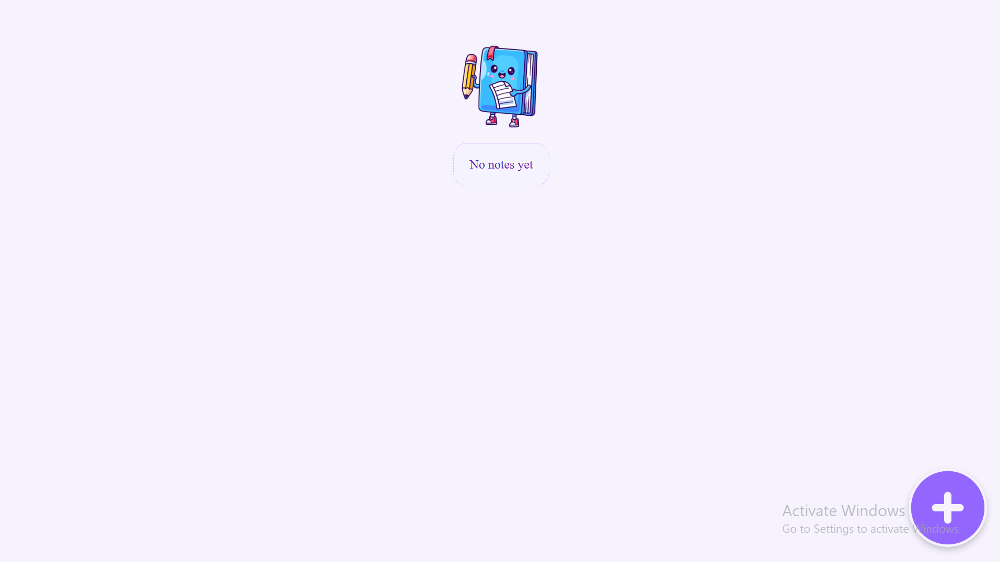
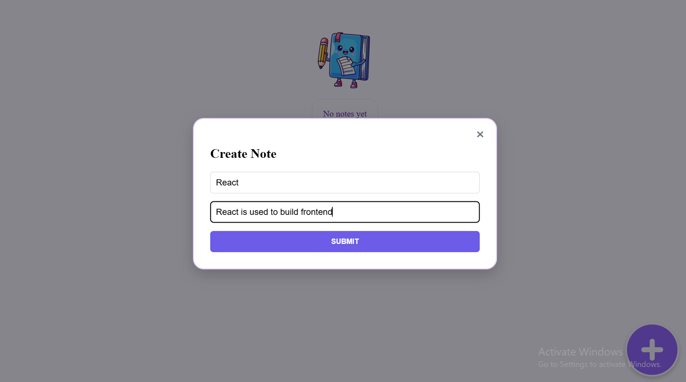
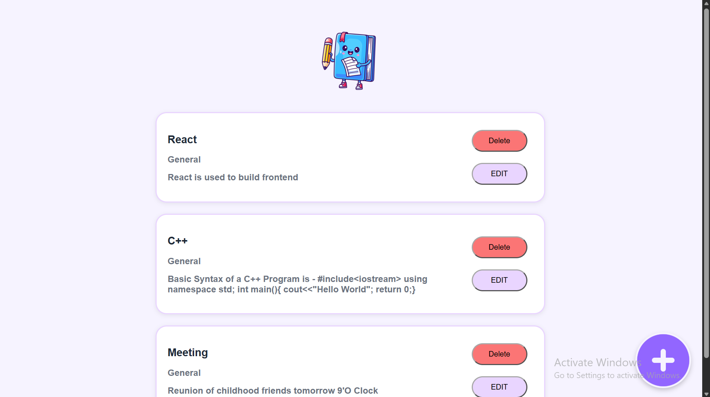

# MERN Notes App

A full-stack notes application built with React, Express,
MongoDB and Mongoose.

## Features

- Create notes
- Edit notes
- Delete notes
- View notes
- MongoDB persistence
- React Hook Form
- Responsive UI

## Tech Stack

Frontend:
- React
- React Hook Form
- CSS

Backend:
- Node.js
- Express
- Mongoose

Database:
- MongoDB Atlas

Deployment:
- Vercel
- Render

## Live Demo

[Your Vercel URL]

## Screenshots

